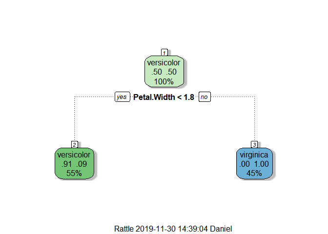
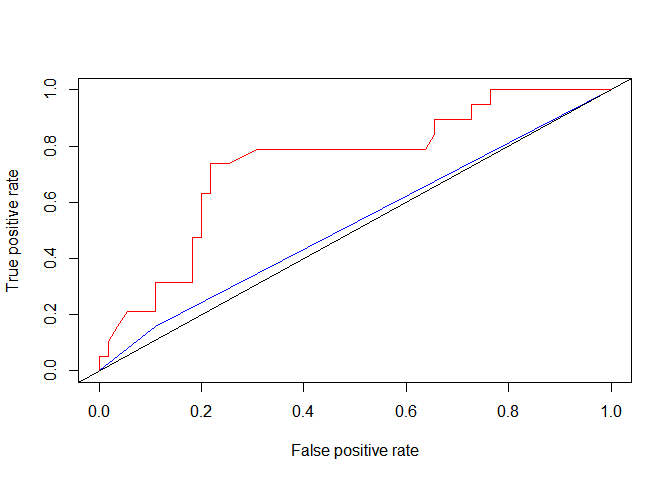
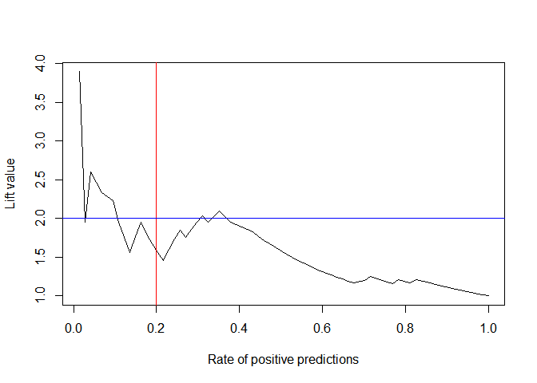

Confusion Matrix in R
================
Daniel\_Kim
2019 11 30

``` r
library(tidyverse)
library(neuralnet)
library(rpart)
```

혼돈행렬에 대해 알아본다. 신경망모형과 의사결정나무 모형 두 모형을 만들고 각각의 모형의 `accuracy`,
`precision`, `recall`, `f1` 값들을 어떻게 구할 수 있는지를 알아보자.

먼저 신경망 모형을 R `neuralnet` 패키지를 활용하자.

학습을 위해 사용할 데이터는 `setosa` 종을 제외한 `iris_1` 데이터이다.

``` r
iris %>%
  filter(Species %in% c('versicolor', 'virginica')) -> iris_1

iris_1$Species <- factor(iris_1$Species, levels = c('versicolor', 'virginica'))
table(iris_1$Species)
```

    ## 
    ## versicolor  virginica 
    ##         50         50

데이터를 훈련용과 테스트용 데이터로 분리한다.

``` r
library(caret)
```

    ## Warning: package 'caret' was built under R version 3.5.3

    ## Loading required package: lattice

    ## 
    ## Attaching package: 'caret'

    ## The following object is masked from 'package:purrr':
    ## 
    ##     lift

``` r
train_idx <- createDataPartition(iris_1$Species, p = .8, list = F)[, 1]
test_idx <- setdiff(1:nrow(iris_1), train_idx)

train_set <- iris_1[train_idx, ]
test_set <- iris_1[test_idx, ]
```

``` r
train_set$Species %>% table()
```

    ## .
    ## versicolor  virginica 
    ##         40         40

``` r
test_set$Species %>% table()
```

    ## .
    ## versicolor  virginica 
    ##         10         10

훈련용 데이터를 이용하여 신경망 모형을
생성한다.

``` r
m_nnet <- neuralnet(Species ~ ., data = train_set, hidden = 2, err.fct = 'ce', linear.output = F,
                    likelihood = T)

m_nnet %>% summary()
```

    ##                     Length Class      Mode    
    ## call                  7    -none-     call    
    ## response            160    -none-     logical 
    ## covariate           320    -none-     numeric 
    ## model.list            2    -none-     list    
    ## err.fct               1    -none-     function
    ## act.fct               1    -none-     function
    ## linear.output         1    -none-     logical 
    ## data                  5    data.frame list    
    ## exclude               0    -none-     NULL    
    ## net.result            1    -none-     list    
    ## weights               1    -none-     list    
    ## generalized.weights   1    -none-     list    
    ## startweights          1    -none-     list    
    ## result.matrix        21    -none-     numeric

신경망모형의 예측값을 확인한다.

``` r
compute(m_nnet, test_set)$net.result[, 2] %>%
  enframe() %>%
  mutate(y_pred_class = ifelse(value >= .5, 1, 0)) %>%
  select(y_pred_class) %>%
  pull() -> vec.yhat_nnet_class; vec.yhat_nnet_class
```

    ##  [1] 0 0 0 1 0 0 0 0 0 0 1 1 1 1 0 1 1 1 1 1

다음으로는 동일한 훈련용 데이터를 이용하여 의사결정나무 모델을 훈련시킨다.

``` r
m_rpart <- rpart(Species ~ ., data = train_set)

m_rpart
```

    ## n= 80 
    ## 
    ## node), split, n, loss, yval, (yprob)
    ##       * denotes terminal node
    ## 
    ## 1) root 80 40 versicolor (0.50000000 0.50000000)  
    ##   2) Petal.Width< 1.75 44  4 versicolor (0.90909091 0.09090909) *
    ##   3) Petal.Width>=1.75 36  0 virginica (0.00000000 1.00000000) *

``` r
library("rattle")
fancyRpartPlot(m_rpart)
```

<!-- -->

의사결정나무의 예측값을 구한다

``` r
predict(m_rpart, test_set, type = 'prob')[, 2] %>%
  enframe() %>%
  mutate(y_pred_class = ifelse(value >= .5, 1, 0)) %>%
  select(y_pred_class) %>%
  pull() -> vec.yhat_rpart_class; vec.yhat_rpart_class
```

    ##  [1] 0 0 0 1 0 0 0 0 0 0 1 1 1 1 0 1 1 1 1 1

이제부터 각 모델에 대한 혼돈행렬을 만들고 각 혼돈행렬을 이용, 각 모델의 `accuarcy`, `precision`,
`recall`, `f1` 값들을 구한다.

``` r
actual <- test_set$Species %>% 
  as.numeric(.) - 1

actual <- actual %>% as.factor()

yhat_nn <- vec.yhat_nnet_class %>% as.factor()

yhat_rpart <- vec.yhat_rpart_class %>% as.factor()

result <- data.frame(actual = actual, 
                     yhat_nn = yhat_nn, 
                     yhat_rpart = yhat_rpart)

result
```

    ##    actual yhat_nn yhat_rpart
    ## 1       0       0          0
    ## 2       0       0          0
    ## 3       0       0          0
    ## 4       0       1          1
    ## 5       0       0          0
    ## 6       0       0          0
    ## 7       0       0          0
    ## 8       0       0          0
    ## 9       0       0          0
    ## 10      0       0          0
    ## 11      1       1          1
    ## 12      1       1          1
    ## 13      1       1          1
    ## 14      1       1          1
    ## 15      1       0          0
    ## 16      1       1          1
    ## 17      1       1          1
    ## 18      1       1          1
    ## 19      1       1          1
    ## 20      1       1          1

`caret` 패키지의 `confusionMatrix()` 함수를 이용하려면 비교하는 원소들이 `factor`형으로 저장되어
있어야 한다.

``` r
library(caret)
nn_con <- confusionMatrix(result$actual, result$yhat_nn)
dt_con <- confusionMatrix(result$actual, result$yhat_rpart)
```

``` r
nn_con$table
```

    ##           Reference
    ## Prediction 0 1
    ##          0 9 1
    ##          1 1 9

``` r
dt_con$table
```

    ##           Reference
    ## Prediction 0 1
    ##          0 9 1
    ##          1 1 9

Metrics 패키지를 이용하려면 원소들이 숫자형으로 채워져 있어야 한다. `factor`형으로 되어 있는 result를
`numeric` 형으로 바꾸어준다.

``` r
library(Metrics)
```

    ## Warning: package 'Metrics' was built under R version 3.5.3

    ## 
    ## Attaching package: 'Metrics'

    ## The following objects are masked from 'package:caret':
    ## 
    ##     precision, recall

``` r
result %>%
  mutate(actual = as.numeric(actual) - 1) %>%
  mutate(yhat_nn = as.numeric(yhat_nn) - 1) %>%
  mutate(yhat_rpart = as.numeric(yhat_rpart) - 1) -> result_1

result_1 %>% str()
```

    ## 'data.frame':    20 obs. of  3 variables:
    ##  $ actual    : num  0 0 0 0 0 0 0 0 0 0 ...
    ##  $ yhat_nn   : num  0 0 0 1 0 0 0 0 0 0 ...
    ##  $ yhat_rpart: num  0 0 0 1 0 0 0 0 0 0 ...

각각의 지표값들을 구한다.

``` r
accuracy <- c(accuracy(result_1$actual, result_1$yhat_nn),
              accuracy(result_1$actual, result_1$yhat_rpart))
# accuracy

precision <- c(Metrics::precision(result_1$actual, result_1$yhat_nn), 
               Metrics::precision(result_1$actual, result_1$yhat_rpart))

# precision

recall <- c(recall(result_1$actual, result_1$yhat_nn),
            recall(result_1$actual, result_1$yhat_rpart))

# recall

f1_score <- c(f1(result_1$actual, result_1$yhat_nn), 
              f1(result_1$actual, result_1$yhat_rpart))

# f1_score

data.frame(
  model  = c('neuralnet', 'rpart'),
  accuracy = accuracy,
  precision = precision,
  recall = recall,
  f1_score = f1_score
) %>%
  gather(variable, value, -model) %>%
  spread(model, value) -> df_scores

df_scores
```

    ##    variable neuralnet rpart
    ## 1  accuracy       0.9   0.9
    ## 2  f1_score       1.0   1.0
    ## 3 precision       0.9   0.9
    ## 4    recall       0.9   0.9

### ROC 그래프

``` r
data('infert')
infert %>% head()
```

    ##   education age parity induced case spontaneous stratum pooled.stratum
    ## 1    0-5yrs  26      6       1    1           2       1              3
    ## 2    0-5yrs  42      1       1    1           0       2              1
    ## 3    0-5yrs  39      6       2    1           0       3              4
    ## 4    0-5yrs  34      4       2    1           0       4              2
    ## 5   6-11yrs  35      3       1    1           1       5             32
    ## 6   6-11yrs  36      4       2    1           1       6             36

``` r
summary(infert)
```

    ##    education        age            parity         induced      
    ##  0-5yrs : 12   Min.   :21.00   Min.   :1.000   Min.   :0.0000  
    ##  6-11yrs:120   1st Qu.:28.00   1st Qu.:1.000   1st Qu.:0.0000  
    ##  12+ yrs:116   Median :31.00   Median :2.000   Median :0.0000  
    ##                Mean   :31.50   Mean   :2.093   Mean   :0.5726  
    ##                3rd Qu.:35.25   3rd Qu.:3.000   3rd Qu.:1.0000  
    ##                Max.   :44.00   Max.   :6.000   Max.   :2.0000  
    ##       case         spontaneous        stratum      pooled.stratum 
    ##  Min.   :0.0000   Min.   :0.0000   Min.   : 1.00   Min.   : 1.00  
    ##  1st Qu.:0.0000   1st Qu.:0.0000   1st Qu.:21.00   1st Qu.:19.00  
    ##  Median :0.0000   Median :0.0000   Median :42.00   Median :36.00  
    ##  Mean   :0.3347   Mean   :0.5766   Mean   :41.87   Mean   :33.58  
    ##  3rd Qu.:1.0000   3rd Qu.:1.0000   3rd Qu.:62.25   3rd Qu.:48.25  
    ##  Max.   :1.0000   Max.   :2.0000   Max.   :83.00   Max.   :63.00

``` r
str(infert)
```

    ## 'data.frame':    248 obs. of  8 variables:
    ##  $ education     : Factor w/ 3 levels "0-5yrs","6-11yrs",..: 1 1 1 1 2 2 2 2 2 2 ...
    ##  $ age           : num  26 42 39 34 35 36 23 32 21 28 ...
    ##  $ parity        : num  6 1 6 4 3 4 1 2 1 2 ...
    ##  $ induced       : num  1 1 2 2 1 2 0 0 0 0 ...
    ##  $ case          : num  1 1 1 1 1 1 1 1 1 1 ...
    ##  $ spontaneous   : num  2 0 0 0 1 1 0 0 1 0 ...
    ##  $ stratum       : int  1 2 3 4 5 6 7 8 9 10 ...
    ##  $ pooled.stratum: num  3 1 4 2 32 36 6 22 5 19 ...

``` r
infert %>%
  dplyr::select(case, age, parity, induced, spontaneous) -> infert_1

infert_1 %>% head()
```

    ##   case age parity induced spontaneous
    ## 1    1  26      6       1           2
    ## 2    1  42      1       1           0
    ## 3    1  39      6       2           0
    ## 4    1  34      4       2           0
    ## 5    1  35      3       1           1
    ## 6    1  36      4       2           1

데이터를 훈련용과 테스트용으로 분리한다.

``` r
library(caret)

set.seed(2019)
train_idx <- createDataPartition(infert_1$case, p = .7, list  = F)[, 1]
test_idx <- setdiff(1:nrow(infert_1), train_idx)
```

``` r
train_set <- infert_1[train_idx, ]
test_set <- infert_1[test_idx, ]
```

``` r
train_set$case %>% table()
```

    ## .
    ##   0   1 
    ## 110  64

``` r
test_set$case %>% table()
```

    ## .
    ##  0  1 
    ## 55 19

`neuralnet`, `C5.0` 을 이용하여 모델을 생성한다.

neuralnet 모델 생성은 다음과 같이
한다.

``` r
m_nnnet <- neuralnet(case ~ ., data = train_set, hidden = 3, err.fct = 'ce', linear.output = F, 
          likelihood = T)

m_nnet %>% summary()
```

    ##                     Length Class      Mode    
    ## call                  7    -none-     call    
    ## response            160    -none-     logical 
    ## covariate           320    -none-     numeric 
    ## model.list            2    -none-     list    
    ## err.fct               1    -none-     function
    ## act.fct               1    -none-     function
    ## linear.output         1    -none-     logical 
    ## data                  5    data.frame list    
    ## exclude               0    -none-     NULL    
    ## net.result            1    -none-     list    
    ## weights               1    -none-     list    
    ## generalized.weights   1    -none-     list    
    ## startweights          1    -none-     list    
    ## result.matrix        21    -none-     numeric

C5.0 모델 생성은 다음과 같이 한다

``` r
library(C50)
```

    ## Warning: package 'C50' was built under R version 3.5.3

``` r
train_set$case <- as.factor(train_set$case)
m_dt <- C5.0(case ~ ., data = train_set)
```

테스트 데이터에 대한 각 모델의 예측값들을 구한다. 먼저 다음과 같이 `m_nnnet` 모델에 대한 예측값을 구한다.

``` r
predict(m_nnnet, newdata = test_set, type = 'prob') %>%
  as_tibble() %>%
  # mutate(V1 = ifelse(V1 >= .5, 1, 0)) %>%
  rename(yhat_nn = V1) -> df_yhat_nn
```

    ## Warning: `as_tibble.matrix()` requires a matrix with column names or a `.name_repair` argument. Using compatibility `.name_repair`.
    ## This warning is displayed once per session.

``` r
df_yhat_nn
```

    ## # A tibble: 74 x 1
    ##    yhat_nn
    ##      <dbl>
    ##  1   0.900
    ##  2   0.163
    ##  3   0.216
    ##  4   0.315
    ##  5   0.355
    ##  6   0.723
    ##  7   0.163
    ##  8   0.998
    ##  9   0.162
    ## 10   0.908
    ## # ... with 64 more rows

그리고 `m_dt` 모델에 대한 예측값을 다음과 같이 구한다.

``` r
predict(m_dt, newdata = test_set, type ='prob') %>%
  as_tibble() %>%
  dplyr::select('1') %>%
  # mutate(value = as.numeric(value) - 1) %>%
  rename(yhat_dt = '1') -> df_yhat_dt


df_yhat_dt
```

    ## # A tibble: 74 x 1
    ##    yhat_dt
    ##      <dbl>
    ##  1   0.293
    ##  2   0.293
    ##  3   0.293
    ##  4   0.293
    ##  5   0.293
    ##  6   0.293
    ##  7   0.293
    ##  8   0.763
    ##  9   0.293
    ## 10   0.763
    ## # ... with 64 more rows

결과값들을 하나의 데이터 프레임에 담아보자..

``` r
test_set$case %>%
  as_tibble() %>%
  rename(actual = value) %>%
  bind_cols(df_yhat_nn) %>%
  bind_cols(df_yhat_dt) -> df_result
```

    ## Warning: Calling `as_tibble()` on a vector is discouraged, because the behavior is likely to change in the future. Use `tibble::enframe(name = NULL)` instead.
    ## This warning is displayed once per session.

``` r
df_result
```

    ## # A tibble: 74 x 3
    ##    actual yhat_nn yhat_dt
    ##     <dbl>   <dbl>   <dbl>
    ##  1      1   0.900   0.293
    ##  2      1   0.163   0.293
    ##  3      1   0.216   0.293
    ##  4      1   0.315   0.293
    ##  5      1   0.355   0.293
    ##  6      1   0.723   0.293
    ##  7      1   0.163   0.293
    ##  8      1   0.998   0.763
    ##  9      1   0.162   0.293
    ## 10      1   0.908   0.763
    ## # ... with 64 more rows

이제 위의 결과값을 이용하여 ROC 그래프를 그려보자.

``` r
library(ROCR)
```

    ## Loading required package: gplots

    ## Warning: package 'gplots' was built under R version 3.5.3

    ## 
    ## Attaching package: 'gplots'

    ## The following object is masked from 'package:stats':
    ## 
    ##     lowess

    ## 
    ## Attaching package: 'ROCR'

    ## The following object is masked from 'package:neuralnet':
    ## 
    ##     prediction

``` r
y_obs <- df_result$actual %>% as.factor()
y_pred_nn <- prediction(df_result$yhat_nn, y_obs)
y_perf_nn <- performance(y_pred_nn, measure = 'tpr', x.measure = 'fpr')

y_pred_dt <- prediction(df_result$yhat_dt, y_obs)
y_perf_dt <- performance(y_pred_dt, measure = 'tpr', x.measure = 'fpr')
```

``` r
plot(y_perf_nn, col = 'red')
plot(y_perf_dt, add = T, col ='blue')
abline(0, 1)
```

<!-- -->

``` r
performance(y_pred_nn, 'auc')@y.values[[1]]
```

    ## [1] 0.738756

``` r
performance(y_pred_dt, 'auc')@y.values[[1]]
```

    ## [1] 0.5244019

여기서 신경망 모형의 향상도 곡선을 그려보자.

``` r
nn_lift <- performance(y_pred_nn, 'lift', 'rpp')
plot(nn_lift)
abline(v = .2, col = 'red')
abline(h = 2, col ='blue')
```

<!-- -->

결과적으로 신경망 모형의 경우 상위 20% 집단에 대해 랜덤 모델과 비교시 약 2배의 성과향상을 보인다.
