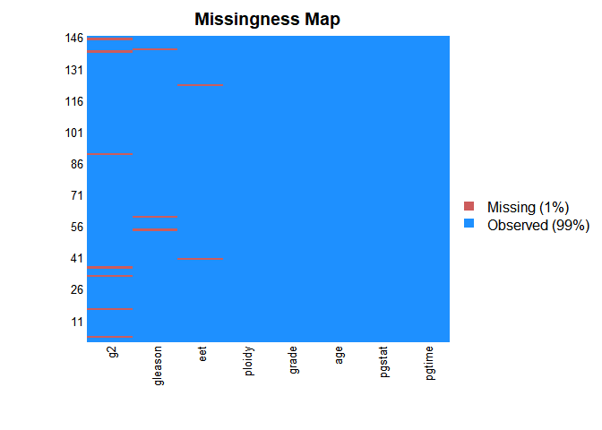
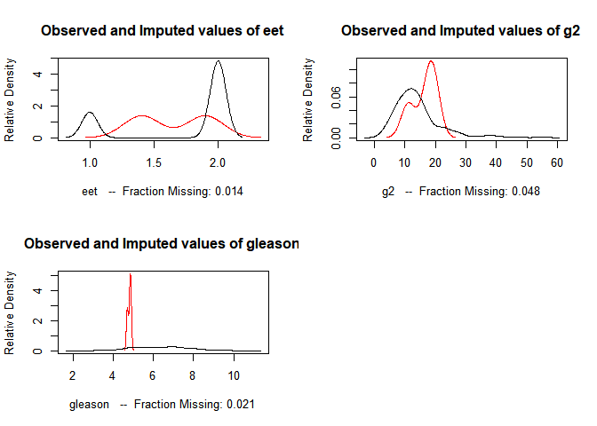
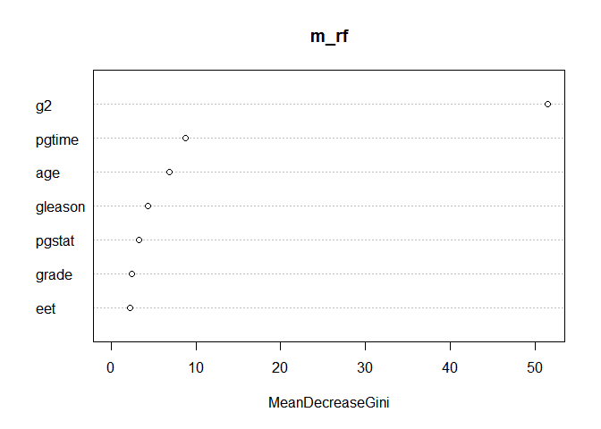
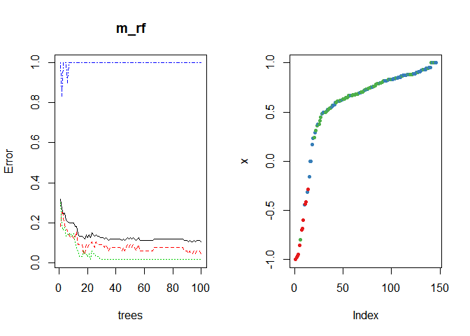

RF analysis with stagec data
================

### Data loading…

데이터를 불러온다.

``` r
library(randomForest)
library(rpart)
library(tidyverse)
data(stagec)
head(stagec)
```

    ##   pgtime pgstat age eet    g2 grade gleason     ploidy
    ## 1    6.1      0  64   2 10.26     2       4    diploid
    ## 2    9.4      0  62   1    NA     3       8  aneuploid
    ## 3    5.2      1  59   2  9.99     3       7    diploid
    ## 4    3.2      1  62   2  3.57     2       4    diploid
    ## 5    1.9      1  64   2 22.56     4       8 tetraploid
    ## 6    4.8      0  69   1  6.14     3       7    diploid

### EDA and NA handling…

데이터에 NA 값들이 보이므로 Amelia 패키지를 이용해 NA 값들의 분포를 시각화하고 이를 imputation 한다.

``` r
summary(stagec)
```

    ##      pgtime           pgstat            age          eet      
    ##  Min.   : 0.300   Min.   :0.0000   Min.   :47   Min.   :1.00  
    ##  1st Qu.: 3.700   1st Qu.:0.0000   1st Qu.:59   1st Qu.:1.75  
    ##  Median : 5.900   Median :0.0000   Median :63   Median :2.00  
    ##  Mean   : 6.324   Mean   :0.3699   Mean   :63   Mean   :1.75  
    ##  3rd Qu.: 7.900   3rd Qu.:1.0000   3rd Qu.:67   3rd Qu.:2.00  
    ##  Max.   :17.700   Max.   :1.0000   Max.   :75   Max.   :2.00  
    ##                                                 NA's   :2     
    ##        g2             grade         gleason             ploidy  
    ##  Min.   : 2.400   Min.   :1.00   Min.   : 3.00   diploid   :67  
    ##  1st Qu.: 9.215   1st Qu.:2.00   1st Qu.: 5.00   tetraploid:68  
    ##  Median :13.010   Median :3.00   Median : 6.00   aneuploid :11  
    ##  Mean   :14.275   Mean   :2.61   Mean   : 6.35                  
    ##  3rd Qu.:16.715   3rd Qu.:3.00   3rd Qu.: 7.00                  
    ##  Max.   :54.930   Max.   :4.00   Max.   :10.00                  
    ##  NA's   :7                       NA's   :3

`eet`, `ge`, `gleason` 컬럼에 NA 값들이 존재한다. `Amelia::missmap()` 함수를 이용해 이를
시각화해본다.

``` r
library(Amelia)
```

    ## Loading required package: Rcpp

    ## Warning: package 'Rcpp' was built under R version 3.5.3

    ## ## 
    ## ## Amelia II: Multiple Imputation
    ## ## (Version 1.7.5, built: 2018-05-07)
    ## ## Copyright (C) 2005-2019 James Honaker, Gary King and Matthew Blackwell
    ## ## Refer to http://gking.harvard.edu/amelia/ for more information
    ## ##

``` r
missmap(stagec)
```

<!-- -->

imputating NA values with amelia package… `amelia()` 함수를 이용해 NA값을 대체한다.

``` r
imp_stagec <- amelia(stagec, m = 5, cs = 'ploidy')
```

    ## -- Imputation 1 --
    ## 
    ##   1  2  3  4
    ## 
    ## -- Imputation 2 --
    ## 
    ##   1  2  3  4
    ## 
    ## -- Imputation 3 --
    ## 
    ##   1  2  3
    ## 
    ## -- Imputation 4 --
    ## 
    ##   1  2  3
    ## 
    ## -- Imputation 5 --
    ## 
    ##   1  2  3  4

5번째 imputation 결과를 최종 데이터셋으로 선택한다.

``` r
stagec_1 <- imp_stagec$imputations[[5]]
summary(stagec_1)
```

    ##      pgtime           pgstat            age          eet       
    ##  Min.   : 0.300   Min.   :0.0000   Min.   :47   Min.   :1.000  
    ##  1st Qu.: 3.700   1st Qu.:0.0000   1st Qu.:59   1st Qu.:1.657  
    ##  Median : 5.900   Median :0.0000   Median :63   Median :2.000  
    ##  Mean   : 6.324   Mean   :0.3699   Mean   :63   Mean   :1.750  
    ##  3rd Qu.: 7.900   3rd Qu.:1.0000   3rd Qu.:67   3rd Qu.:2.000  
    ##  Max.   :17.700   Max.   :1.0000   Max.   :75   Max.   :2.024  
    ##        g2             grade         gleason             ploidy  
    ##  Min.   : 2.400   Min.   :1.00   Min.   : 3.00   diploid   :67  
    ##  1st Qu.: 9.463   1st Qu.:2.00   1st Qu.: 5.00   tetraploid:68  
    ##  Median :12.970   Median :3.00   Median : 6.00   aneuploid :11  
    ##  Mean   :14.292   Mean   :2.61   Mean   : 6.32                  
    ##  3rd Qu.:16.753   3rd Qu.:3.00   3rd Qu.: 7.00                  
    ##  Max.   :54.930   Max.   :4.00   Max.   :10.00

``` r
par(mfrow = c(1, 2))
plot(imp_stagec)
missmap(stagec_1)
```

<!-- --><!-- -->

### Modeling with randomForest…

위의 정제된 데이터를 이용하여 랜덤포레스트 모델을 생성한다. (data spliting into train and test
set)

``` r
library(caret)
train_idx <- createDataPartition(stagec_1$ploidy, p =.8, list = F)[, 1]
test_idx <- setdiff(1:nrow(stagec_1), train_idx)

train_set <- stagec_1[train_idx, ]
test_set <- stagec_1[test_idx, ]
```

``` r
train_set %>%dim()
```

    ## [1] 118   8

``` r
test_set %>% dim()
```

    ## [1] 28  8

traing rf
model..

``` r
m_rf <- randomForest(ploidy ~ ., data = stagec_1, ntree = 100, proximity = T)

m_rf
```

    ## 
    ## Call:
    ##  randomForest(formula = ploidy ~ ., data = stagec_1, ntree = 100,      proximity = T) 
    ##                Type of random forest: classification
    ##                      Number of trees: 100
    ## No. of variables tried at each split: 2
    ## 
    ##         OOB estimate of  error rate: 10.27%
    ## Confusion matrix:
    ##            diploid tetraploid aneuploid class.error
    ## diploid         64          1         2  0.04477612
    ## tetraploid       1         67         0  0.01470588
    ## aneuploid        7          4         0  1.00000000

### Which variables did do important role to this rf model?

``` r
importance(m_rf)
```

    ##         MeanDecreaseGini
    ## pgtime          8.718961
    ## pgstat          3.286792
    ## age             6.894459
    ## eet             2.212860
    ## g2             51.488134
    ## grade           2.451633
    ## gleason         4.338041

``` r
varImpPlot(m_rf)
```

<!-- -->

g2, pgtime 등의 순으로 모델의 중요변수임을 알 수 있다.

### Evaluating trained model

Confusion matrix를 생성해보자.

``` r
actual <- test_set[, 'ploidy']
yhat_rf <- predict(m_rf, test_set %>% dplyr::select(-ploidy))

confusionMatrix(actual, yhat_rf)
```

    ## Confusion Matrix and Statistics
    ## 
    ##             Reference
    ## Prediction   diploid tetraploid aneuploid
    ##   diploid         13          0         0
    ##   tetraploid       0         13         0
    ##   aneuploid        0          0         2
    ## 
    ## Overall Statistics
    ##                                      
    ##                Accuracy : 1          
    ##                  95% CI : (0.8766, 1)
    ##     No Information Rate : 0.4643     
    ##     P-Value [Acc > NIR] : 4.677e-10  
    ##                                      
    ##                   Kappa : 1          
    ##                                      
    ##  Mcnemar's Test P-Value : NA         
    ## 
    ## Statistics by Class:
    ## 
    ##                      Class: diploid Class: tetraploid Class: aneuploid
    ## Sensitivity                  1.0000            1.0000          1.00000
    ## Specificity                  1.0000            1.0000          1.00000
    ## Pos Pred Value               1.0000            1.0000          1.00000
    ## Neg Pred Value               1.0000            1.0000          1.00000
    ## Prevalence                   0.4643            0.4643          0.07143
    ## Detection Rate               0.4643            0.4643          0.07143
    ## Detection Prevalence         0.4643            0.4643          0.07143
    ## Balanced Accuracy            1.0000            1.0000          1.00000

정확도가 1이 나왔다. 생성한 랜덤포레스트 모델은 모든 테스트 데이터들을 올바르게 분류했다. Accuray is 1\!\!\!

``` r
par(mfrow = c(1, 2))
plot(m_rf)
plot(randomForest::margin(m_rf))
```

<!-- -->

``` r
par(mfrow = c(1, 1))
```
